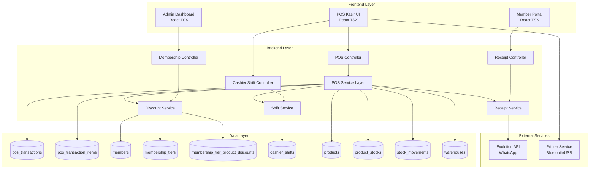
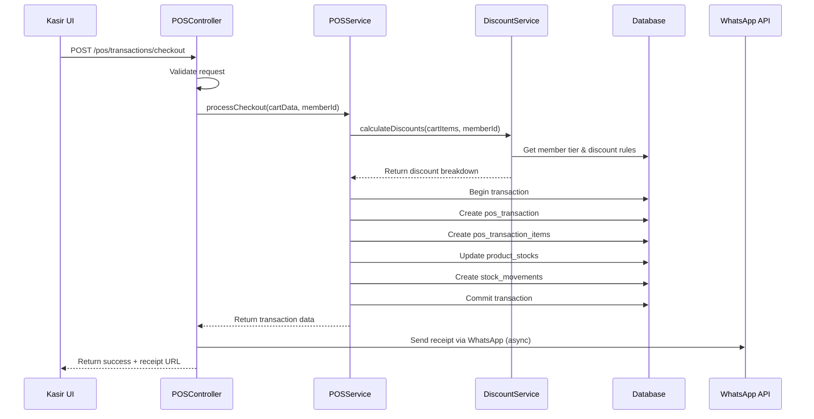
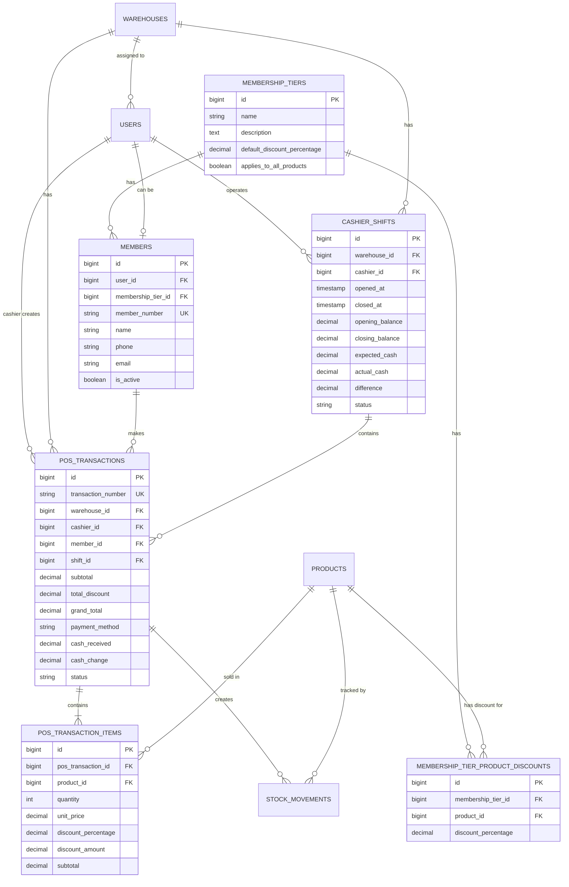

# Design Document: POS Kasir (Point of Sale)

## Overview

Sistem Point of Sale (POS) Kasir adalah fitur terintegrasi untuk mengelola transaksi penjualan di toko fisik dengan dukungan multi-cabang, membership dengan diskon fleksibel, dan struk digital via WhatsApp. Sistem ini dibangun di atas infrastruktur Laravel + Inertia + React TSX yang sudah ada, memanfaatkan model Product, ProductStock, StockMovement, Warehouse, dan User yang telah tersedia.

**Key Features:**
- Transaksi POS dengan scan barcode dan keranjang belanja
- Membership system dengan diskon bertingkat dan per-produk
- Struk digital via WhatsApp + website
- Multi-cabang dengan isolasi stok per warehouse
- Shift kasir management dengan rekonsiliasi cash
- Laporan penjualan per cabang

**Technology Stack:**
- Backend: Laravel 11.x (PHP 8.2+)
- Frontend: React 18.x + TypeScript + Inertia.js
- Database: MySQL/PostgreSQL
- Mobile: Capacitor (barcode scanning)
- WhatsApp: Evolution API (existing integration)

## Architecture

### High-Level Architecture



### Layer Responsibilities

**Frontend Layer:**
- POS Kasir UI: Interface untuk kasir melakukan transaksi (scan, keranjang, checkout)
- Member Portal: Interface untuk member melihat riwayat transaksi
- Admin Dashboard: Interface untuk admin mengelola membership, diskon, dan laporan

**Backend Layer:**
- Controllers: Handle HTTP requests, validation, dan response
- Service Layer: Business logic kompleks (diskon calculation, shift management, receipt generation)
- Models: Eloquent ORM untuk database interaction

**Data Layer:**
- 6 tabel baru untuk POS system
- Integrasi dengan tabel existing (products, product_stocks, stock_movements, warehouses, users)

**External Services:**
- Evolution API: Kirim struk digital via WhatsApp
- Printer Service: Print struk fisik (Bluetooth/USB)

### Request Flow Example: Checkout Transaction



## Components and Interfaces

### Backend Components

#### 1. Controllers

**POSController** (`app/Http/Controllers/POSController.php`)
```php
class POSController extends Controller
{
    public function __construct(
        private POSService $posService,
        private DiscountService $discountService
    ) {}
    
    // GET /pos - Render POS UI
    public function index(): Response
    
    // GET /pos/products/search - Search products by name/SKU/barcode
    public function searchProducts(Request $request): JsonResponse
    
    // POST /pos/cart/preview - Preview cart with discounts (before checkout)
    public function previewCart(Request $request): JsonResponse
    
    // POST /pos/transactions/checkout - Process checkout
    public function checkout(CheckoutRequest $request): JsonResponse
    
    // GET /pos/transactions - List transactions (for current shift/warehouse)
    public function index(Request $request): Response
    
    // GET /pos/transactions/{transaction} - Show transaction detail
    public function show(PosTransaction $transaction): JsonResponse
    
    // POST /pos/transactions/{transaction}/void - Void transaction (before shift close)
    public function void(PosTransaction $transaction): JsonResponse
}
```

**MembershipController** (`app/Http/Controllers/Settings/MembershipController.php`)
```php
class MembershipController extends Controller
{
    // Membership Tiers
    public function indexTiers(): Response
    public function storeTier(StoreTierRequest $request): RedirectResponse
    public function updateTier(UpdateTierRequest $request, MembershipTier $tier): RedirectResponse
    public function destroyTier(MembershipTier $tier): RedirectResponse
    
    // Product-Specific Discounts
    public function indexProductDiscounts(MembershipTier $tier): JsonResponse
    public function storeProductDiscount(StoreProductDiscountRequest $request): JsonResponse
    public function destroyProductDiscount(MembershipTierProductDiscount $discount): JsonResponse
    
    // Members
    public function indexMembers(): Response
    public function storeMember(StoreMemberRequest $request): RedirectResponse
    public function updateMember(UpdateMemberRequest $request, Member $member): RedirectResponse
    public function destroyMember(Member $member): RedirectResponse
    public function searchMembers(Request $request): JsonResponse
}
```

**CashierShiftController** (`app/Http/Controllers/CashierShiftController.php`)
```php
class CashierShiftController extends Controller
{
    public function __construct(private ShiftService $shiftService) {}
    
    // GET /pos/shifts/current - Get current active shift
    public function current(): JsonResponse
    
    // POST /pos/shifts/open - Open new shift
    public function open(OpenShiftRequest $request): JsonResponse
    
    // POST /pos/shifts/close - Close current shift
    public function close(CloseShiftRequest $request): JsonResponse
    
    // GET /pos/shifts - List shift history
    public function index(Request $request): Response
    
    // GET /pos/shifts/{shift} - Show shift detail
    public function show(CashierShift $shift): JsonResponse
}
```

**ReceiptController** (`app/Http/Controllers/ReceiptController.php`)
```php
class ReceiptController extends Controller
{
    public function __construct(private ReceiptService $receiptService) {}
    
    // GET /pos/receipts/{transactionNumber} - View receipt (requires auth)
    public function show(string $transactionNumber): Response
    
    // POST /pos/receipts/{transaction}/send-whatsapp - Resend receipt via WhatsApp
    public function sendWhatsApp(PosTransaction $transaction, Request $request): JsonResponse
    
    // GET /pos/receipts/{transaction}/print - Get printable receipt HTML
    public function print(PosTransaction $transaction): Response
}
```

**POSReportController** (`app/Http/Controllers/POSReportController.php`)
```php
class POSReportController extends Controller
{
    // GET /pos/reports/dashboard - Dashboard overview
    public function dashboard(Request $request): Response
    
    // GET /pos/reports/sales - Sales report (filterable by date, warehouse, cashier)
    public function sales(Request $request): JsonResponse
    
    // GET /pos/reports/top-products - Top selling products
    public function topProducts(Request $request): JsonResponse
    
    // GET /pos/reports/branch-comparison - Compare performance across branches
    public function branchComparison(Request $request): JsonResponse
}
```

#### 2. Service Layer

**POSService** (`app/Services/POSService.php`)
```php
class POSService
{
    public function __construct(
        private DiscountService $discountService,
        private ReceiptService $receiptService
    ) {}
    
    /**
     * Preview cart with calculated discounts
     */
    public function previewCart(array $cartItems, ?int $memberId, int $warehouseId): array
    
    /**
     * Process checkout and create transaction
     */
    public function processCheckout(
        array $cartItems,
        ?int $memberId,
        int $warehouseId,
        int $cashierId,
        ?int $shiftId,
        float $cashReceived
    ): PosTransaction
    
    /**
     * Void transaction (only if shift not closed)
     */
    public function voidTransaction(PosTransaction $transaction): bool
    
    /**
     * Get available stock for product in warehouse
     */
    public function getAvailableStock(int $productId, int $warehouseId): int
    
    /**
     * Search products by query (name, SKU, barcode)
     */
    public function searchProducts(string $query, int $warehouseId, int $limit = 20): Collection
}
```

**DiscountService** (`app/Services/DiscountService.php`)
```php
class DiscountService
{
    /**
     * Calculate discounts for cart items based on member tier
     */
    public function calculateDiscounts(array $cartItems, ?int $memberId): array
    
    /**
     * Get discount percentage for specific product and member tier
     */
    public function getProductDiscount(int $productId, int $membershipTierId): float
    
    /**
     * Get member tier with discount rules
     */
    public function getMemberTier(int $memberId): ?MembershipTier
}
```

**ShiftService** (`app/Services/ShiftService.php`)
```php
class ShiftService
{
    /**
     * Get current active shift for cashier
     */
    public function getCurrentShift(int $cashierId, int $warehouseId): ?CashierShift
    
    /**
     * Open new shift
     */
    public function openShift(int $cashierId, int $warehouseId, float $openingBalance): CashierShift
    
    /**
     * Close shift with cash reconciliation
     */
    public function closeShift(CashierShift $shift, float $actualCash): CashierShift
    
    /**
     * Calculate expected cash for shift
     */
    public function calculateExpectedCash(CashierShift $shift): float
    
    /**
     * Check if cashier can perform transaction (has active shift)
     */
    public function canPerformTransaction(int $cashierId, int $warehouseId): bool
}
```

**ReceiptService** (`app/Services/ReceiptService.php`)
```php
class ReceiptService
{
    public function __construct(private WhatsAppService $whatsAppService) {}
    
    /**
     * Generate transaction number (POS-YYYYMMDD-XXXX)
     */
    public function generateTransactionNumber(): string
    
    /**
     * Send receipt via WhatsApp
     */
    public function sendReceiptViaWhatsApp(PosTransaction $transaction, string $phoneNumber): bool
    
    /**
     * Generate receipt HTML for printing
     */
    public function generateReceiptHTML(PosTransaction $transaction): string
    
    /**
     * Get receipt URL
     */
    public function getReceiptUrl(string $transactionNumber): string
}
```

#### 3. Models

**MembershipTier** (`app/Models/MembershipTier.php`)
```php
class MembershipTier extends Model
{
    protected $fillable = [
        'name',
        'description',
        'default_discount_percentage',
        'applies_to_all_products',
    ];
    
    protected $casts = [
        'default_discount_percentage' => 'float',
        'applies_to_all_products' => 'boolean',
    ];
    
    public function members(): HasMany
    public function productDiscounts(): HasMany
}
```

**MembershipTierProductDiscount** (`app/Models/MembershipTierProductDiscount.php`)
```php
class MembershipTierProductDiscount extends Model
{
    protected $fillable = [
        'membership_tier_id',
        'product_id',
        'discount_percentage',
    ];
    
    protected $casts = [
        'discount_percentage' => 'float',
    ];
    
    public function membershipTier(): BelongsTo
    public function product(): BelongsTo
}
```

**Member** (`app/Models/Member.php`)
```php
class Member extends Model
{
    protected $fillable = [
        'user_id',
        'membership_tier_id',
        'member_number',
        'name',
        'phone',
        'email',
        'is_active',
    ];
    
    protected $casts = [
        'is_active' => 'boolean',
    ];
    
    public function user(): BelongsTo
    public function membershipTier(): BelongsTo
    public function transactions(): HasMany
}
```

**PosTransaction** (`app/Models/PosTransaction.php`)
```php
class PosTransaction extends Model
{
    protected $fillable = [
        'transaction_number',
        'warehouse_id',
        'cashier_id',
        'member_id',
        'shift_id',
        'subtotal',
        'total_discount',
        'grand_total',
        'payment_method',
        'cash_received',
        'cash_change',
        'status',
    ];
    
    protected $casts = [
        'subtotal' => 'float',
        'total_discount' => 'float',
        'grand_total' => 'float',
        'cash_received' => 'float',
        'cash_change' => 'float',
    ];
    
    public function warehouse(): BelongsTo
    public function cashier(): BelongsTo
    public function member(): BelongsTo
    public function shift(): BelongsTo
    public function items(): HasMany
    public function stockMovements(): HasMany
}
```

**PosTransactionItem** (`app/Models/PosTransactionItem.php`)
```php
class PosTransactionItem extends Model
{
    protected $fillable = [
        'pos_transaction_id',
        'product_id',
        'quantity',
        'unit_price',
        'discount_percentage',
        'discount_amount',
        'subtotal',
    ];
    
    protected $casts = [
        'quantity' => 'integer',
        'unit_price' => 'float',
        'discount_percentage' => 'float',
        'discount_amount' => 'float',
        'subtotal' => 'float',
    ];
    
    public function transaction(): BelongsTo
    public function product(): BelongsTo
}
```

**CashierShift** (`app/Models/CashierShift.php`)
```php
class CashierShift extends Model
{
    protected $fillable = [
        'warehouse_id',
        'cashier_id',
        'opened_at',
        'closed_at',
        'opening_balance',
        'closing_balance',
        'expected_cash',
        'actual_cash',
        'difference',
        'status',
    ];
    
    protected $casts = [
        'opened_at' => 'datetime',
        'closed_at' => 'datetime',
        'opening_balance' => 'float',
        'closing_balance' => 'float',
        'expected_cash' => 'float',
        'actual_cash' => 'float',
        'difference' => 'float',
    ];
    
    public function warehouse(): BelongsTo
    public function cashier(): BelongsTo
    public function transactions(): HasMany
}
```

#### 4. Form Requests

**CheckoutRequest** (`app/Http/Requests/CheckoutRequest.php`)
```php
class CheckoutRequest extends FormRequest
{
    public function rules(): array
    {
        return [
            'cart_items' => 'required|array|min:1',
            'cart_items.*.product_id' => 'required|exists:products,id',
            'cart_items.*.quantity' => 'required|integer|min:1',
            'member_id' => 'nullable|exists:members,id',
            'cash_received' => 'required|numeric|min:0',
        ];
    }
    
    public function withValidator($validator)
    {
        $validator->after(function ($validator) {
            // Validate stock availability
            // Validate cash_received >= grand_total
        });
    }
}
```

### Frontend Components

#### 1. POS Kasir UI

**Main POS Page** (`resources/js/pages/pos/index.tsx`)
```tsx
export default function POSPage() {
    const [cart, setCart] = useState<CartItem[]>([]);
    const [member, setMember] = useState<Member | null>(null);
    const [currentShift, setCurrentShift] = useState<CashierShift | null>(null);
    
    return (
        <div className="pos-layout">
            <ProductSearch onAddToCart={handleAddToCart} />
            <Cart 
                items={cart}
                member={member}
                onUpdateQuantity={handleUpdateQuantity}
                onRemoveItem={handleRemoveItem}
                onClearCart={handleClearCart}
            />
            <CheckoutPanel
                cart={cart}
                member={member}
                onCheckout={handleCheckout}
            />
        </div>
    );
}
```

**Components:**
- `ProductSearch.tsx`: Search bar + barcode scanner integration
- `Cart.tsx`: Display cart items with edit/delete actions
- `CheckoutPanel.tsx`: Member selection, payment input, checkout button
- `MemberSelector.tsx`: Search and select member
- `ReceiptModal.tsx`: Show receipt after checkout with print/WhatsApp options
- `ShiftManager.tsx`: Open/close shift interface

#### 2. Member Portal

**Transaction History** (`resources/js/pages/member/transactions.tsx`)
```tsx
export default function MemberTransactions() {
    const { transactions } = usePage<{ transactions: PosTransaction[] }>().props;
    
    return (
        <div>
            <h1>Riwayat Transaksi</h1>
            <TransactionList transactions={transactions} />
        </div>
    );
}
```

**Receipt Detail** (`resources/js/pages/receipts/show.tsx`)
```tsx
export default function ReceiptDetail() {
    const { transaction } = usePage<{ transaction: PosTransaction }>().props;
    
    return (
        <div className="receipt-container">
            <ReceiptHeader transaction={transaction} />
            <ReceiptItems items={transaction.items} />
            <ReceiptSummary transaction={transaction} />
        </div>
    );
}
```

#### 3. Admin Dashboard

**Membership Management** (`resources/js/pages/settings/membership/index.tsx`)
```tsx
export default function MembershipManagement() {
    return (
        <div>
            <Tabs>
                <Tab label="Membership Tiers">
                    <TierList />
                </Tab>
                <Tab label="Members">
                    <MemberList />
                </Tab>
                <Tab label="Product Discounts">
                    <ProductDiscountList />
                </Tab>
            </Tabs>
        </div>
    );
}
```

**POS Reports** (`resources/js/pages/pos/reports/index.tsx`)
```tsx
export default function POSReports() {
    return (
        <div>
            <ReportFilters />
            <SalesSummary />
            <TopProductsChart />
            <BranchComparisonChart />
            <TransactionTable />
        </div>
    );
}
```

### API Endpoints

#### POS Transactions
```
GET    /pos                              - Render POS UI
GET    /pos/products/search              - Search products
POST   /pos/cart/preview                 - Preview cart with discounts
POST   /pos/transactions/checkout        - Process checkout
GET    /pos/transactions                 - List transactions
GET    /pos/transactions/{transaction}   - Show transaction detail
POST   /pos/transactions/{transaction}/void - Void transaction
```

#### Cashier Shifts
```
GET    /pos/shifts/current               - Get current active shift
POST   /pos/shifts/open                  - Open new shift
POST   /pos/shifts/close                 - Close current shift
GET    /pos/shifts                       - List shift history
GET    /pos/shifts/{shift}               - Show shift detail
```

#### Receipts
```
GET    /pos/receipts/{transactionNumber} - View receipt (auth required)
POST   /pos/receipts/{transaction}/send-whatsapp - Resend via WhatsApp
GET    /pos/receipts/{transaction}/print - Get printable HTML
```

#### Membership Management
```
GET    /settings/membership/tiers        - List tiers
POST   /settings/membership/tiers        - Create tier
PUT    /settings/membership/tiers/{tier} - Update tier
DELETE /settings/membership/tiers/{tier} - Delete tier

GET    /settings/membership/tiers/{tier}/discounts - List product discounts
POST   /settings/membership/tiers/{tier}/discounts - Create product discount
DELETE /settings/membership/discounts/{discount}   - Delete product discount

GET    /settings/membership/members      - List members
POST   /settings/membership/members      - Create member
PUT    /settings/membership/members/{member} - Update member
DELETE /settings/membership/members/{member} - Delete member
GET    /settings/membership/members/search - Search members
```

#### Reports
```
GET    /pos/reports/dashboard            - Dashboard overview
GET    /pos/reports/sales                - Sales report
GET    /pos/reports/top-products         - Top selling products
GET    /pos/reports/branch-comparison    - Branch comparison
```

## Data Models

### Database Schema

#### 1. membership_tiers
```sql
CREATE TABLE membership_tiers (
    id BIGINT UNSIGNED AUTO_INCREMENT PRIMARY KEY,
    name VARCHAR(255) NOT NULL,
    description TEXT NULL,
    default_discount_percentage DECIMAL(5,2) NOT NULL DEFAULT 0.00,
    applies_to_all_products BOOLEAN NOT NULL DEFAULT true,
    created_at TIMESTAMP NULL,
    updated_at TIMESTAMP NULL,
    
    INDEX idx_name (name)
);
```

#### 2. membership_tier_product_discounts
```sql
CREATE TABLE membership_tier_product_discounts (
    id BIGINT UNSIGNED AUTO_INCREMENT PRIMARY KEY,
    membership_tier_id BIGINT UNSIGNED NOT NULL,
    product_id BIGINT UNSIGNED NOT NULL,
    discount_percentage DECIMAL(5,2) NOT NULL,
    created_at TIMESTAMP NULL,
    updated_at TIMESTAMP NULL,
    
    FOREIGN KEY (membership_tier_id) REFERENCES membership_tiers(id) ON DELETE CASCADE,
    FOREIGN KEY (product_id) REFERENCES products(id) ON DELETE CASCADE,
    UNIQUE KEY unique_tier_product (membership_tier_id, product_id),
    INDEX idx_tier (membership_tier_id),
    INDEX idx_product (product_id)
);
```

#### 3. members
```sql
CREATE TABLE members (
    id BIGINT UNSIGNED AUTO_INCREMENT PRIMARY KEY,
    user_id BIGINT UNSIGNED NULL,
    membership_tier_id BIGINT UNSIGNED NOT NULL,
    member_number VARCHAR(50) NOT NULL UNIQUE,
    name VARCHAR(255) NOT NULL,
    phone VARCHAR(20) NOT NULL,
    email VARCHAR(255) NULL,
    is_active BOOLEAN NOT NULL DEFAULT true,
    created_at TIMESTAMP NULL,
    updated_at TIMESTAMP NULL,
    
    FOREIGN KEY (user_id) REFERENCES users(id) ON DELETE SET NULL,
    FOREIGN KEY (membership_tier_id) REFERENCES membership_tiers(id) ON DELETE RESTRICT,
    INDEX idx_member_number (member_number),
    INDEX idx_phone (phone),
    INDEX idx_user (user_id),
    INDEX idx_tier (membership_tier_id)
);
```

#### 4. pos_transactions
```sql
CREATE TABLE pos_transactions (
    id BIGINT UNSIGNED AUTO_INCREMENT PRIMARY KEY,
    transaction_number VARCHAR(50) NOT NULL UNIQUE,
    warehouse_id BIGINT UNSIGNED NOT NULL,
    cashier_id BIGINT UNSIGNED NOT NULL,
    member_id BIGINT UNSIGNED NULL,
    shift_id BIGINT UNSIGNED NULL,
    subtotal DECIMAL(15,2) NOT NULL,
    total_discount DECIMAL(15,2) NOT NULL DEFAULT 0.00,
    grand_total DECIMAL(15,2) NOT NULL,
    payment_method VARCHAR(50) NOT NULL DEFAULT 'cash',
    cash_received DECIMAL(15,2) NULL,
    cash_change DECIMAL(15,2) NULL,
    status VARCHAR(20) NOT NULL DEFAULT 'completed',
    created_at TIMESTAMP NULL,
    updated_at TIMESTAMP NULL,
    
    FOREIGN KEY (warehouse_id) REFERENCES warehouses(id) ON DELETE RESTRICT,
    FOREIGN KEY (cashier_id) REFERENCES users(id) ON DELETE RESTRICT,
    FOREIGN KEY (member_id) REFERENCES members(id) ON DELETE SET NULL,
    FOREIGN KEY (shift_id) REFERENCES cashier_shifts(id) ON DELETE SET NULL,
    INDEX idx_transaction_number (transaction_number),
    INDEX idx_warehouse (warehouse_id),
    INDEX idx_cashier (cashier_id),
    INDEX idx_member (member_id),
    INDEX idx_shift (shift_id),
    INDEX idx_status (status),
    INDEX idx_created_at (created_at)
);
```

#### 5. pos_transaction_items
```sql
CREATE TABLE pos_transaction_items (
    id BIGINT UNSIGNED AUTO_INCREMENT PRIMARY KEY,
    pos_transaction_id BIGINT UNSIGNED NOT NULL,
    product_id BIGINT UNSIGNED NOT NULL,
    quantity INT NOT NULL,
    unit_price DECIMAL(15,2) NOT NULL,
    discount_percentage DECIMAL(5,2) NOT NULL DEFAULT 0.00,
    discount_amount DECIMAL(15,2) NOT NULL DEFAULT 0.00,
    subtotal DECIMAL(15,2) NOT NULL,
    created_at TIMESTAMP NULL,
    updated_at TIMESTAMP NULL,
    
    FOREIGN KEY (pos_transaction_id) REFERENCES pos_transactions(id) ON DELETE CASCADE,
    FOREIGN KEY (product_id) REFERENCES products(id) ON DELETE RESTRICT,
    INDEX idx_transaction (pos_transaction_id),
    INDEX idx_product (product_id)
);
```

#### 6. cashier_shifts
```sql
CREATE TABLE cashier_shifts (
    id BIGINT UNSIGNED AUTO_INCREMENT PRIMARY KEY,
    warehouse_id BIGINT UNSIGNED NOT NULL,
    cashier_id BIGINT UNSIGNED NOT NULL,
    opened_at TIMESTAMP NOT NULL,
    closed_at TIMESTAMP NULL,
    opening_balance DECIMAL(15,2) NOT NULL,
    closing_balance DECIMAL(15,2) NULL,
    expected_cash DECIMAL(15,2) NULL,
    actual_cash DECIMAL(15,2) NULL,
    difference DECIMAL(15,2) NULL,
    status VARCHAR(20) NOT NULL DEFAULT 'open',
    created_at TIMESTAMP NULL,
    updated_at TIMESTAMP NULL,
    
    FOREIGN KEY (warehouse_id) REFERENCES warehouses(id) ON DELETE RESTRICT,
    FOREIGN KEY (cashier_id) REFERENCES users(id) ON DELETE RESTRICT,
    INDEX idx_warehouse (warehouse_id),
    INDEX idx_cashier (cashier_id),
    INDEX idx_status (status),
    INDEX idx_opened_at (opened_at)
);
```

#### 7. Migration: Add warehouse_id to users table
```sql
ALTER TABLE users ADD COLUMN warehouse_id BIGINT UNSIGNED NULL AFTER role_id;
ALTER TABLE users ADD FOREIGN KEY (warehouse_id) REFERENCES warehouses(id) ON DELETE SET NULL;
CREATE INDEX idx_warehouse ON users(warehouse_id);
```

### Entity Relationship Diagram



### Model Relationships

**MembershipTier:**
- `hasMany(Member)` - A tier has many members
- `hasMany(MembershipTierProductDiscount)` - A tier has many product-specific discounts

**Member:**
- `belongsTo(User)` - A member can be linked to a user account (optional)
- `belongsTo(MembershipTier)` - A member belongs to a tier
- `hasMany(PosTransaction)` - A member has many transactions

**PosTransaction:**
- `belongsTo(Warehouse)` - A transaction belongs to a warehouse/branch
- `belongsTo(User, 'cashier_id')` - A transaction is created by a cashier
- `belongsTo(Member)` - A transaction can be linked to a member (optional)
- `belongsTo(CashierShift)` - A transaction belongs to a shift (optional)
- `hasMany(PosTransactionItem)` - A transaction has many items
- `hasMany(StockMovement)` - A transaction creates stock movements

**PosTransactionItem:**
- `belongsTo(PosTransaction)` - An item belongs to a transaction
- `belongsTo(Product)` - An item references a product

**CashierShift:**
- `belongsTo(Warehouse)` - A shift belongs to a warehouse/branch
- `belongsTo(User, 'cashier_id')` - A shift is operated by a cashier
- `hasMany(PosTransaction)` - A shift has many transactions

**User (extended):**
- `belongsTo(Warehouse)` - A user (kasir) can be assigned to a warehouse
- `hasMany(PosTransaction, 'cashier_id')` - A user creates transactions as cashier
- `hasMany(CashierShift, 'cashier_id')` - A user operates shifts
- `hasOne(Member)` - A user can be a member (optional)

**Warehouse (extended):**
- `hasMany(PosTransaction)` - A warehouse has many transactions
- `hasMany(CashierShift)` - A warehouse has many shifts
- `hasMany(User)` - A warehouse has assigned cashiers

**Product (extended):**
- `hasMany(PosTransactionItem)` - A product is sold in many transaction items
- `hasMany(MembershipTierProductDiscount)` - A product can have tier-specific discounts

## Correctness Properties

*A property is a characteristic or behavior that should hold true across all valid executions of a system—essentially, a formal statement about what the system should do. Properties serve as the bridge between human-readable specifications and machine-verifiable correctness guarantees.*


### Property 1: Cart Calculation Correctness

*For any* cart with items and optional member discount, the calculated subtotal, total_discount, and grand_total must satisfy:
- `subtotal = sum(item.unit_price * item.quantity)`
- `total_discount = sum(item.discount_amount)`
- `grand_total = subtotal - total_discount`
- `item.discount_amount = item.unit_price * item.quantity * (item.discount_percentage / 100)`

**Validates: Requirements AC-2.3, AC-3.5**

### Property 2: Discount Calculation with Priority

*For any* product and member tier combination, the applied discount must follow these rules:
- If product has specific discount for the tier in `membership_tier_product_discounts`, use that discount
- Else if tier has `applies_to_all_products = true`, use tier's `default_discount_percentage`
- Else discount is 0%
- The largest applicable discount is always applied

**Validates: Requirements AC-3.3, AC-3.4, AC-8.2**

### Property 3: Cash Change Calculation

*For any* transaction where `cash_received >= grand_total`, the cash change must equal:
- `cash_change = cash_received - grand_total`

And the transaction should be accepted. If `cash_received < grand_total`, the transaction should be rejected.

**Validates: Requirements AC-4.4**

### Property 4: Stock Consistency and Warehouse Isolation

*For any* completed POS transaction, the following must hold:
- For each transaction item, `product_stock.quantity` in the transaction's warehouse must decrease by exactly `item.quantity`
- A `StockMovement` record must be created with `type = 'pos_sale'`, `warehouse_id = transaction.warehouse_id`, `quantity = -item.quantity`
- Stock changes only affect the transaction's warehouse, not other warehouses

**Validates: Requirements AC-4.6, AC-13.2, AC-13.3**

### Property 5: No Overselling

*For any* product and warehouse combination, the system must reject adding to cart if:
- `requested_quantity > available_stock` where `available_stock = product_stocks.quantity` for that warehouse

**Validates: Requirements AC-1.5**

### Property 6: Transaction Data Persistence (Round-Trip)

*For any* valid transaction data, after saving to database and retrieving:
- All transaction fields must match the original data
- All transaction items must be preserved with correct values
- Transaction can be retrieved by `transaction_number`

**Validates: Requirements AC-4.5, AC-5.6**

### Property 7: Shift Cash Balance Calculation

*For any* cashier shift, when closing the shift:
- `expected_cash = opening_balance + sum(transaction.grand_total WHERE transaction.payment_method = 'cash' AND transaction.shift_id = shift.id)`
- `difference = actual_cash - expected_cash`

**Validates: Requirements AC-11.5**

### Property 8: Shift Transaction Isolation

*For any* cashier, at any given time:
- There can be at most one shift with `status = 'open'` per warehouse
- Transactions can only be created if cashier has an active shift in the transaction's warehouse
- `transaction.shift_id` must reference an open shift

**Validates: Requirements AC-11.3**

### Property 9: Warehouse Isolation for Cashiers

*For any* user with role "kasir" and assigned `warehouse_id`:
- Product search results must only include products with stock in that warehouse
- Transaction list must only include transactions where `transaction.warehouse_id = user.warehouse_id`
- Cannot create transactions for other warehouses

**Validates: Requirements AC-12.3, AC-13.1, AC-13.4**

### Property 10: Member Receipt Access Control

*For any* receipt access attempt:
- If user is member and `transaction.member_id = user.member.id`, allow access
- If user has role "admin" or "supervisor", allow access
- Otherwise, deny access

**Validates: Requirements AC-6.4**

### Property 11: Member Number Uniqueness

*For any* set of members in the system:
- All `member_number` values must be unique
- No two members can have the same `member_number`

**Validates: Requirements AC-9.4**

### Property 12: Search Result Correctness

*For any* search query and product dataset:
- Search results must only include products where query matches `name`, `sku`, or `barcode` (case-insensitive)
- For kasir users, results must be filtered by their `warehouse_id`

**Validates: Requirements AC-1.2, AC-9.5, AC-13.1**

### Property 13: Report Aggregation Accuracy

*For any* date range and warehouse filter:
- Total transaction count = count of all transactions matching filter
- Total omzet = sum of `grand_total` for all transactions matching filter
- Total discount = sum of `total_discount` for all transactions matching filter
- Member vs non-member breakdown: count where `member_id IS NOT NULL` vs `member_id IS NULL`

**Validates: Requirements AC-10.1, AC-10.2, AC-10.3**

### Property 14: Multi-Warehouse Report Consolidation

*For any* consolidated report across all warehouses:
- Consolidated total = sum of totals from each warehouse
- Per-warehouse totals must be correctly calculated and isolated
- Admin can see all warehouses, supervisor can only see their assigned warehouse

**Validates: Requirements AC-14.1, AC-14.2, AC-14.4, AC-14.5**

### Property 15: Top Products Ranking

*For any* date range and warehouse filter:
- Top products are ranked by total quantity sold (sum of `pos_transaction_items.quantity` grouped by `product_id`)
- Products with higher total quantity must rank higher
- Ranking must be consistent and deterministic

**Validates: Requirements AC-10.5**

### Property 16: Receipt Message Format

*For any* transaction, the WhatsApp receipt message must contain:
- Store name
- Transaction number
- Transaction date
- Grand total
- Receipt URL in format `/pos/receipts/{transaction_number}`

**Validates: Requirements AC-5.4, AC-5.5**

### Property 17: CRUD Data Integrity

*For any* entity (MembershipTier, Member, ProductDiscount):
- After create, entity can be retrieved with all fields intact
- After update, changes are persisted correctly
- After delete, entity is no longer retrievable

**Validates: Requirements AC-7.1, AC-7.2, AC-7.4, AC-8.3, AC-8.5, AC-9.1, AC-9.2**

## Error Handling

### Validation Errors

**Stock Validation:**
- Before adding to cart: Check if `quantity <= available_stock`
- Error response: `422 Unprocessable Entity` with message "Stok tidak mencukupi. Stok tersedia: {available_stock}"

**Payment Validation:**
- Before checkout: Check if `cash_received >= grand_total`
- Error response: `422 Unprocessable Entity` with message "Uang yang diterima kurang dari total yang harus dibayar"

**Shift Validation:**
- Before transaction: Check if cashier has active shift
- Error response: `403 Forbidden` with message "Anda harus membuka shift terlebih dahulu"

**Warehouse Validation:**
- Before transaction: Check if product belongs to cashier's warehouse
- Error response: `403 Forbidden` with message "Produk tidak tersedia di cabang Anda"

**Member Validation:**
- Before applying member: Check if member is active
- Error response: `422 Unprocessable Entity` with message "Member tidak aktif"

### Business Logic Errors

**Duplicate Transaction:**
- Use idempotency key to prevent duplicate transactions during offline sync
- If duplicate detected, return existing transaction instead of creating new one

**Concurrent Stock Updates:**
- Use database row locking (`SELECT ... FOR UPDATE`) when updating stock
- If stock becomes insufficient during transaction, rollback and return error

**Shift Already Open:**
- Before opening shift: Check if cashier already has open shift in warehouse
- Error response: `422 Unprocessable Entity` with message "Anda sudah memiliki shift yang aktif"

**Void Transaction After Shift Close:**
- Before voiding: Check if transaction's shift is still open
- Error response: `403 Forbidden` with message "Tidak dapat membatalkan transaksi setelah shift ditutup"

### External Service Errors

**WhatsApp Send Failure:**
- If WhatsApp API fails, log error but don't fail transaction
- Transaction is still saved, receipt can be resent later
- Show warning to cashier: "Transaksi berhasil, tetapi gagal mengirim struk via WhatsApp"

**Printer Failure:**
- If printer fails, show error but allow retry
- Transaction is still saved, receipt can be reprinted
- Show error: "Gagal mencetak struk. Silakan coba lagi atau kirim via WhatsApp"

### Database Errors

**Transaction Rollback:**
- Wrap checkout process in database transaction
- If any step fails (save transaction, update stock, create stock movement), rollback all changes
- Return error with appropriate message

**Unique Constraint Violation:**
- If member_number already exists, return error
- Error response: `422 Unprocessable Entity` with message "Nomor member sudah digunakan"

## Testing Strategy

### Unit Tests

**Service Layer Tests:**
- `POSService::previewCart()` - Test cart calculation with various scenarios
- `POSService::processCheckout()` - Test checkout flow with mocked dependencies
- `DiscountService::calculateDiscounts()` - Test discount calculation logic
- `DiscountService::getProductDiscount()` - Test discount priority rules
- `ShiftService::calculateExpectedCash()` - Test shift cash calculation
- `ReceiptService::generateTransactionNumber()` - Test transaction number format
- `ReceiptService::generateReceiptHTML()` - Test receipt HTML generation

**Model Tests:**
- Test model relationships (hasMany, belongsTo)
- Test model casts (decimal, boolean, datetime)
- Test model scopes (if any)

**Validation Tests:**
- Test FormRequest validation rules
- Test custom validation logic (stock availability, cash received)

### Property-Based Tests

**Testing Library:** [Pest PHP](https://pestphp.com/) with [pest-plugin-faker](https://github.com/pestphp/pest-plugin-faker) for property-based testing

**Configuration:**
- Minimum 100 iterations per property test
- Use Faker to generate random test data
- Tag each test with feature name and property number

**Property Test Examples:**

```php
// Feature: pos-kasir, Property 1: Cart Calculation Correctness
it('calculates cart totals correctly for any cart items', function () {
    // Generate random cart items
    $items = collect(range(1, rand(1, 10)))->map(fn() => [
        'product_id' => Product::factory()->create()->id,
        'quantity' => rand(1, 100),
        'unit_price' => rand(1000, 100000),
        'discount_percentage' => rand(0, 50),
    ]);
    
    $result = app(POSService::class)->previewCart($items->toArray(), null, 1);
    
    // Verify calculations
    $expectedSubtotal = $items->sum(fn($item) => $item['unit_price'] * $item['quantity']);
    $expectedDiscount = $items->sum(fn($item) => 
        $item['unit_price'] * $item['quantity'] * ($item['discount_percentage'] / 100)
    );
    $expectedGrandTotal = $expectedSubtotal - $expectedDiscount;
    
    expect($result['subtotal'])->toBe($expectedSubtotal);
    expect($result['total_discount'])->toBe($expectedDiscount);
    expect($result['grand_total'])->toBe($expectedGrandTotal);
})->repeat(100);

// Feature: pos-kasir, Property 4: Stock Consistency and Warehouse Isolation
it('decreases stock correctly for any transaction', function () {
    $warehouse = Warehouse::factory()->create();
    $product = Product::factory()->create();
    $initialStock = rand(100, 1000);
    ProductStock::factory()->create([
        'product_id' => $product->id,
        'warehouse_id' => $warehouse->id,
        'quantity' => $initialStock,
    ]);
    
    $quantity = rand(1, 50);
    $transaction = app(POSService::class)->processCheckout(
        [['product_id' => $product->id, 'quantity' => $quantity]],
        null,
        $warehouse->id,
        User::factory()->create()->id,
        null,
        100000
    );
    
    $finalStock = ProductStock::where('product_id', $product->id)
        ->where('warehouse_id', $warehouse->id)
        ->value('quantity');
    
    expect($finalStock)->toBe($initialStock - $quantity);
    
    $stockMovement = StockMovement::where('product_id', $product->id)
        ->where('warehouse_id', $warehouse->id)
        ->where('type', 'pos_sale')
        ->first();
    
    expect($stockMovement)->not->toBeNull();
    expect($stockMovement->quantity)->toBe(-$quantity);
})->repeat(100);
```

### Integration Tests

**Controller Tests:**
- Test HTTP endpoints with various request payloads
- Test authentication and authorization
- Test response formats and status codes

**Database Tests:**
- Test migrations run successfully
- Test foreign key constraints
- Test unique constraints

**External Service Tests:**
- Mock WhatsApp API and test message sending
- Mock printer service and test receipt printing

### End-to-End Tests

**User Flows:**
- Complete checkout flow: scan product → add to cart → apply member → checkout → print receipt
- Shift management flow: open shift → perform transactions → close shift
- Member portal flow: login → view transactions → view receipt detail

**Browser Tests (Laravel Dusk):**
- Test POS UI interactions
- Test barcode scanner integration
- Test keyboard shortcuts

## Printer Integration Strategy

### Printer Types

**1. Bluetooth Printer (Mobile/Tablet)**
- Use Capacitor plugin: `@capacitor-community/bluetooth-le` or similar
- Detect available Bluetooth printers
- Send ESC/POS commands to printer
- Handle connection errors gracefully

**2. USB/Network Printer (PC)**
- Use browser's native print API (`window.print()`)
- Generate print-friendly HTML receipt
- Use CSS `@media print` for print-specific styling
- Support for thermal printers via browser print dialog

### Receipt Format

**Thermal Printer (58mm/80mm):**
```
================================
        NAMA TOKO
     Alamat Toko
   Telp: 0812-3456-7890
================================
No: POS-20260422-0001
Tanggal: 22/04/2026 14:30
Kasir: John Doe
Member: MEMBER001 (Gold)
================================
Item                 Qty  Total
--------------------------------
Produk A           2  20,000
  Diskon 10%           -2,000
Produk B           1  50,000
  Diskon 5%            -2,500
--------------------------------
Subtotal:             70,000
Total Diskon:         -4,500
================================
GRAND TOTAL:          65,500
================================
Tunai:                70,000
Kembali:               4,500
================================
   Terima Kasih!
 Belanja Lagi Ya :)
================================
```

### Implementation

**ReceiptService::generateReceiptHTML():**
```php
public function generateReceiptHTML(PosTransaction $transaction): string
{
    return view('receipts.print', [
        'transaction' => $transaction->load(['items.product', 'member', 'cashier', 'warehouse']),
        'storeName' => config('app.store_name'),
        'storeAddress' => config('app.store_address'),
        'storePhone' => config('app.store_phone'),
    ])->render();
}
```

**Print View (`resources/views/receipts/print.blade.php`):**
```blade
<!DOCTYPE html>
<html>
<head>
    <meta charset="utf-8">
    <title>Struk - {{ $transaction->transaction_number }}</title>
    <style>
        @media print {
            body { margin: 0; padding: 0; }
            .no-print { display: none; }
        }
        body {
            font-family: 'Courier New', monospace;
            font-size: 12px;
            width: 80mm;
            margin: 0 auto;
        }
        .center { text-align: center; }
        .separator { border-top: 1px dashed #000; margin: 5px 0; }
        .item-row { display: flex; justify-content: space-between; }
    </style>
</head>
<body>
    <div class="center">
        <h2>{{ $storeName }}</h2>
        <p>{{ $storeAddress }}</p>
        <p>Telp: {{ $storePhone }}</p>
    </div>
    <div class="separator"></div>
    <!-- Receipt content -->
</body>
</html>
```

**Capacitor Bluetooth Printing:**
```typescript
// resources/js/services/PrinterService.ts
export class PrinterService {
    async printReceipt(receiptHTML: string) {
        if (Capacitor.isNativePlatform()) {
            // Use Bluetooth printer
            await this.printViaBluetooth(receiptHTML);
        } else {
            // Use browser print
            this.printViaBrowser(receiptHTML);
        }
    }
    
    private async printViaBluetooth(receiptHTML: string) {
        // Convert HTML to ESC/POS commands
        const escPosCommands = this.htmlToEscPos(receiptHTML);
        
        // Send to Bluetooth printer
        await BluetoothPrinter.print({ data: escPosCommands });
    }
    
    private printViaBrowser(receiptHTML: string) {
        const printWindow = window.open('', '_blank');
        printWindow.document.write(receiptHTML);
        printWindow.document.close();
        printWindow.print();
    }
}
```

---

**Document Version:** 1.0  
**Last Updated:** 2026-04-22  
**Status:** Draft for Review
